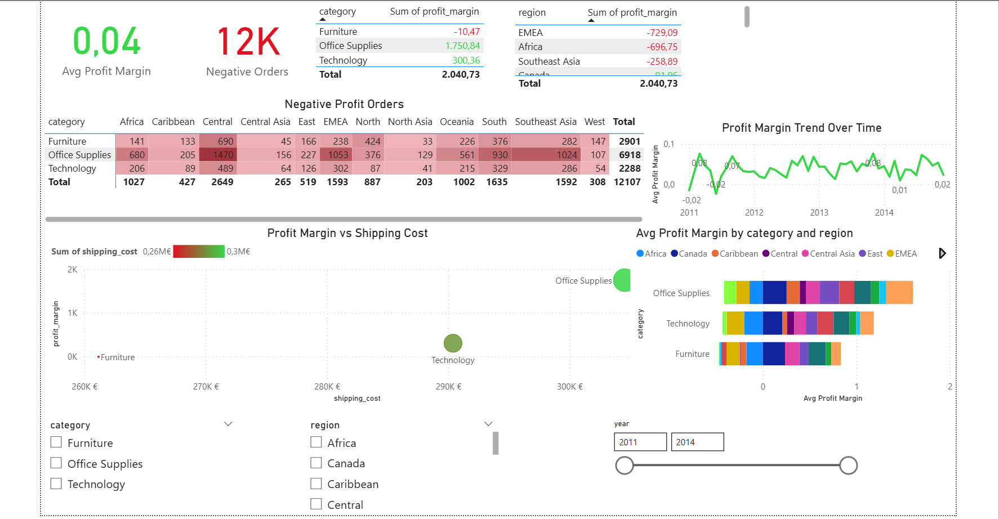

# Superstore Sales Analysis Project

This project analyzes a **Superstore Sales dataset** to generate actionable business insights using **Python, PostgreSQL, and Power BI**.  
The goal is to understand sales trends, profitability, top products/customers, and regional performance.

## Dataset

Original dataset: [Superstore Sales Dataset on Kaggle](https://www.kaggle.com/datasets/laibaanwer/superstore-sales-dataset?resource=download)

- Raw dataset stored in `dataset/` (unzipped)
- Processed/cleaned dataset for Power BI stored in `PowerBI_datasets/superstore_cleaned.csv`

## Business Questions

- What are total sales and profit trends?
- Which products/customers generate the most revenue?
- Which regions perform best?
- Are there seasonal patterns?
- How much profit is made per unit of sales? (Profit Margin = Profit / Sales)

## Tools Used

- **Python** (Pandas, NumPy) for cleaning and preparing datasets  
- **PostgreSQL** for running SQL queries and analysis  
- **Power BI** for dashboards and KPI visualization  
- **Jupyter Notebook** for reproducible analysis

## Project Workflow

1. **Data Cleaning**  
   - Handled nulls and incorrect data types using Python  
   - Created a clean dataset for Power BI  

2. **SQL Analysis**  
   - Ran PostgreSQL queries to answer business questions  
   - Saved query outputs in `sql_results/`  

3. **Power BI Dashboards**  
   - Loaded cleaned dataset (`PowerBI_datasets/superstore_cleaned.csv`)  
   - Built KPI cards and visualizations for:
     - Average profit margin
     - Negative profit orders
     - Sales and profit trends
     - Top products/customers and regions  

4. **Insights & Recommendations**  
   - See below for key metrics and actionable recommendations
  
## Key Insights

| Metric | Observation | Recommendation |
|--------|------------|----------------|
| Average Profit Margin | 4.2% | Promote high-margin products, review discount policy |
| Negative Profit Orders | 12,107 (~25%) | Investigate unprofitable orders, optimize pricing/shipping |
| Worst Category | Furniture | Adjust pricing, reduce shipping, negotiate supplier costs |
| Worst Region | Africa | Optimize logistics, adjust pricing strategy |

> The company is keeping only ~4 cents per €1 of sales on average, and nearly 1 in 4 orders loses money. Furniture products and the Africa region show the lowest profitability.

## Results

- SQL query outputs saved in `sql_results/`  
- Cleaned dataset for Power BI in `PowerBI_datasets/superstore_cleaned.csv`  
- Power BI dashboard saved in `SuperStore.pbix`  
- Screenshot of final dashboard:



## How to Run

Install Python libraries:

```bash
pip install -r requirements.txt
```

# Cleaning dataset for Power BI
jupyter notebook notebooks/01_data_cleaning.ipynb

# Running SQL queries and saving results
jupyter notebook notebooks/02_sql_queries.ipynb

---

### Folder Structure

```markdown
superstore-Data-Analysis-Project/
│
├─ dataset/                     # Original dataset (unzipped)
├─ notebooks/                   # Cleaning and SQL notebooks
├─ sql_results/                 # CSV outputs from SQL queries
├─ PowerBI_datasets/            # Cleaned datasets for Power BI
├─ SuperStore.pbix              # Final Power BI dashboard
├─ Queries.sql                  # SQL queries
├─ images/                      # Screenshots
├─ README.md
├─ requirements.txt
```
